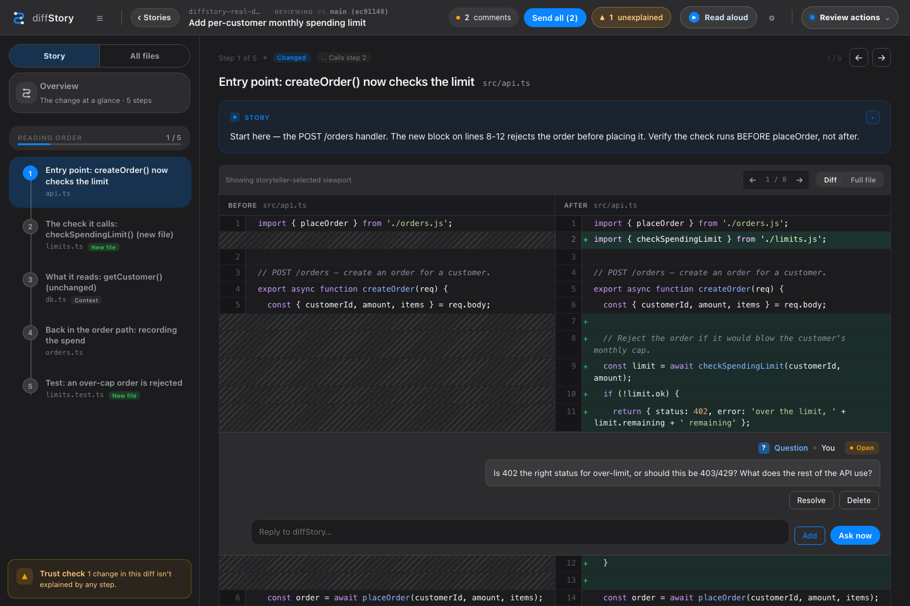
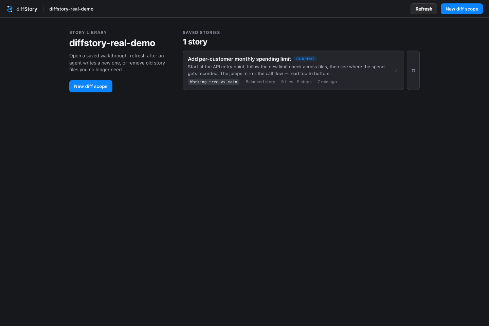

# diffStory

[](https://github.com/naveedinno/diffStory/actions/workflows/ci.yml)
[](LICENSE)

Read a code change in the order it actually makes sense.



diffStory is a local desktop app for reviewing git diffs. Open the app,
pick a repo, choose what changed, and review the real diff with an optional
AI-written walkthrough. When something needs work, select the exact text, add a
comment, and send it back to your agent.

- Runs locally on your machine.
- Uses a proper desktop UI, not a terminal review flow.
- Works with plain git diffs, even without generating a story.
- Can use Claude or Codex to generate walkthroughs and address comments.
- Works without AI. Agent features are optional.

## Quickstart

Build requirements:

- macOS
- Node.js 20 or newer
- Rust and Cargo
- git
- a local git repository you want to review

No Python is required for the core app.

Install the macOS app from a source checkout:

```sh
git clone https://github.com/naveedinno/diffStory.git
cd diffStory
npm install
./scripts/install-macos-app.sh
```

Then open **diffStory** from Spotlight, Finder, or Launchpad. There is no
diffStory CLI and no terminal review workflow.

Optional: install Claude or Codex on your PATH if you want generated stories or
agent-handled review comments.

## Demo

Try a realistic throwaway review without touching your own repos:

```sh
git clone https://github.com/naveedinno/diffStory.git
cd diffStory
npm install
npm run demo
```

The demo creates a temporary git repo with a saved story, changed files, and a
couple of comments so you can see the full review loop.



## First Review

1. Make changes in any local git repo.
2. Open the **diffStory** app.
3. Pick a repo from **Choose your workspace**.
4. Choose what you want to review: uncommitted changes, the current branch, one
   commit, or any two refs.
5. Read the diff in **All files**, or open **Story** and generate a guided
   walkthrough.
6. Select exact text in the diff, right-click, and add a comment.
7. In the header, choose an **Agent task**: reuse an existing Codex task or
   start a new one. Every composer shows that destination before **Ask agent**,
   and later questions keep reusing it until you choose another task.

You can use diffStory as a clean diff viewer without an agent. The AI parts are
only needed when you want generated stories or agent-handled comments.

## What You See

The first screen is your project list.

- Recent repositories appear automatically after you open them once.
- **Add repository** lets you pick another local git repo.
- Missing or non-git folders are marked so you can remove them from recents.

Inside a repo, diffStory gives you two useful ways to read:

- **All files** shows the real git diff file by file.
- **Story** rebuilds the minimum app context around the task, then walks the
  existing entry point, changed decision, downstream effect, and proof in the
  order the logic flows—not alphabetically by filename. Each step frames the
  relevant surrounding code, including unchanged lines when they explain the
  boundary, and spotlights the exact evidence for each narration beat. When a
  change introduces a new term, lifecycle, or architectural boundary, the story
  can pause for a short **concept primer** before the code that depends on it.
  Primers are document steps with optional locally rendered Mermaid diagrams;
  they do not pretend to be files and do not count as diff coverage.

The story never replaces the diff. It only explains and orders it. The code you
read comes from git.

## Review Workflow

diffStory keeps long reviews oriented and makes the handoff back from an agent
explicit:

- **Review rounds** capture the diff when feedback is sent and again when the
  agent finishes. Use **Since review** to inspect only the follow-up changes.
- **Feedback verification** collects addressed comments in one inbox. Accept a
  fix after checking it, or reopen the comment without losing the conversation.
- **Reusable Codex tasks** keep review questions in the implementation chat you
  select. The binding is remembered per repository in this browser, and a new
  task becomes the destination for later questions as soon as its first run completes.
- **Review** stays focused on unresolved feedback, the review timeline, and
  approval. Copy and resend recovery actions live under **More review actions**.
- **File search and filters** narrow the sidebar to seen or unseen files, files with
  comments, unexplained changes, tests, or files changed since your review.
- **Resume review** returns to the last file, line, and display mode on this
  device. **Next unseen** keeps a larger review moving.
- Select diff text to reveal the quick comment action. Press `C` to comment on
  the current selection, `/` to search files, or `?` for the command palette.
- A story step can be repaired in place: ask the agent to explain it, shorten
  it, or split it without regenerating the rest of the walkthrough.
- Open a story step to land on its first spotlight, then select any narration
  beat to move the highlight to the exact lines it explains. Read-aloud follows
  the same camera path automatically.
- The review timeline records feedback handoffs, agent completions, replies, and
  verification decisions for the current change.

## Agent Setup

The installer copies the bundled diffStory skills into the common agent skills
location. If the app says skills are missing or stale, use the **Update skills**
button in the browser.

Claude Code users can also install the plugin:

```text
/plugin marketplace add naveedinno/diffStory
/plugin install diffstory@diffstory
```

For Codex, Cursor, and other agents that read local skills, you can also install
the skills from a clone:

```sh
git clone git@github.com:naveedinno/diffStory.git
cd diffStory
./scripts/install-skills.sh
```

If no agent is installed, diffStory still opens and still works as a local diff
viewer. Story generation and comment handoff will be unavailable until Claude or
Codex is on your PATH.

## Review Files

diffStory stores review state inside the repo you open:

```text
.diffstory/story.json      generated reading order
.diffstory/comments.json   local review comments and agent replies
.diffstory/review-state.json review rounds, snapshots, and timeline events
.diffstory/stories/        optional saved named stories
```

By default, keep `.diffstory/` local and add it to `.gitignore`.

If your team intentionally wants replayable walkthroughs, share a story file as
part of your review process and make that convention explicit. Comments are
normally local reviewer state.

## Team Use

If diffStory is in a private repository, each teammate needs normal GitHub access
first, the same as cloning the repo. Each teammate installs and opens the macOS
app; there is no CLI installation path.

A teammate can replay a walkthrough when they have:

1. the same branch or commit range checked out
2. access to the story file your team chose to share
3. the diffStory app installed locally

They open the app, pick the repo, and open the saved story. No agent is needed
just to read an existing walkthrough.

## From Source

Use this when you are developing diffStory itself:

```sh
git clone https://github.com/naveedinno/diffStory.git
cd diffStory
npm install
npm run dev
```

The app opens at `http://localhost:7777/`. If the browser does not open
automatically, open the printed URL yourself.

That is the whole core setup. You do not need Python, Homebrew, Kokoro, Claude,
or Codex just to open the app and review diffs.

Useful development commands:

| Command | Use |
| --- | --- |
| `npm run dev` | Build and run the internal web server for development. |
| `npm run build` | Compile `src/` into `dist/`. |
| `npm run start` | Run the built internal development server. |
| `npm run demo` | Build and open a sample review. |
| `npm test` | Build and run the test suite. |
| `npm run setup:kokoro` | Install optional local Kokoro speech support. |

## Optional Local Voice

Kokoro AI voice is optional. The read-aloud popup works with browser voices by
default, and you only need this setup if you want local generated speech:

```sh
npm run setup:kokoro
```

The setup script reuses a compatible Python if you already have one, creates
`~/.diffstory/kokoro-venv`, installs `kokoro` and `soundfile`, and installs
`espeak-ng` through Homebrew on macOS when needed. Kokoro currently supports
Python 3.10, 3.11, or 3.12. After setup, choose **Kokoro AI** in the voice
settings.

## Troubleshooting

**The app does not open**

Re-run `./scripts/install-macos-app.sh` from the source checkout, then open
**diffStory** from Spotlight, Finder, or Launchpad.

**A repo is not accepted**

The folder must be a git repository. Open the folder that contains `.git`, or
paste that path into the project picker.

**Story generation says skills are missing or stale**

Click **Update skills** in the app, or rerun:

```sh
./scripts/install-skills.sh
```

from a diffStory clone.

**No Claude or Codex is found**

Install one of them and make sure its command is available on your PATH. You can
still read diffs without an agent.

**Why are Codex Cloud tasks not in the destination picker?**

The current Codex Cloud CLI can list and start Cloud tasks, but it does not
provide a follow-up/resume operation. diffStory lists resumable local and Codex
Desktop tasks for the selected repository instead of presenting a Cloud task it
cannot continue.

## How It Works

The diffStory desktop app starts its private local Node server and renders the UI. The server
reads your local git repository, renders the diff, stores review state in
`.diffstory/`, and can ask Claude or Codex to generate or address review work.

The app uses Node built-ins for its runtime server. It does not need a hosted
service, database, browser extension, or cloud account.

For the story schema and agent contract, see
[`skills/diffstory-storyteller/SKILL.md`](skills/diffstory-storyteller/SKILL.md).

## Contributing

See [CONTRIBUTING.md](CONTRIBUTING.md) for local setup, checks, and contribution
notes. The short version:

```sh
npm run check
```

Release maintainers should also read [docs/RELEASE.md](docs/RELEASE.md).

## License

diffStory is source-available under the
[PolyForm Noncommercial License 1.0.0](LICENSE).

Personal, hobby, research, testing, and other noncommercial use is allowed.
Commercial use requires a separate commercial license from naveedinno
<naveedinno@proton.me>. That includes embedding diffStory or a modified
version in a paid product, proprietary app, hosted service, client project,
internal company tool, or commercial workflow.

This is not an OSI open-source license because commercial use is reserved.
